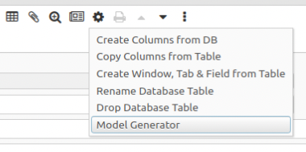

# iDempiere Model Generator

This plugin help to create model of your tables into a plugin, migrated from swing ModelGenerator


- Copyright: INGEINT <http://www.ingeint.com> and Contributors.

- License: GPL 2


## Contributors

- Orlando Curieles <orlando.curieles@ingeint.com>.
- Andreas Sumerauer <ansum@soundbytes.de>
- The authors of the original generator classes:
    - Jörg Janke
    - Teo Sarca
    - Victor Perez

## Prerequisites

The Model Generator works best with a patched PO.java
The patch is not required for basic functionality. However if you want 
to generate model classes that are derived from core models I recommend to install it. (source and instructions at the bottom of this document.)


## Installation

- clone this project into a local repository on your computer
- in Eclipse add the project to the workspace through  
File > Import ... > General > Existing Projects into Workspace
- (re)start the idempiere server

## Preparation

- Create a custom Entity Type for your project, if you have not already done so.  
Don't forget to also set the *ModelPackage* field (e.g. org.myorg.model)
- Set the ``DEFAULT_ENTITYTYPE`` System Configuration item to your project's entity type.
- set the ``Default_Source_Folder`` System Configuration item to your project's source folder path.

## Usage

To create a model class from a new custom table use the *Model Generator* command from the *Table and Column* window's Process Button (Gear icon).



This will produce a dialog. If you followed the preparation steps correctly the form should already be populated with meaningful data:

### Custom Tables


Now check the settings for correctness. Use the two checkboxes at the bottom of the dialog to select which files will be created.

Check the *Create Model Base Class* box to generate ...
  
... the model interface. It includes
- column name definitions
- function prototypes for the getters and setters

... the model base class with 
- default constructors 
- getters and setters for the table columns

These two classes must never be edited or customized. Instead you will just recreate them whenever you have made changes to the database table definition.

For a new table you might want to also check the *Create Custom Class* box. This will generate a Stub that you can extend with custom functions and data to modify the behavior of the model class.  
Note: The Model Generator can not be used to overwrite an existing custom class. To do that just delete the existing file before creating the new one. 

Hitting OK will save the generator settings and generate the source code files as specified.
In the Eclipse Project Explorer click on your project's source folder and select refresh from the context menu to make the changes available to the IDE.

### Extending an existing model

The Model Generator can also be used to generate child classes of existing (core) models.


The generator will generate a child class to the existing model when a core table is selected (or any table whose entity type differs from that of your project) 

Classes generated this way are very similar to those created with the custom table option. Differences:

- The generated base class extends a core model instead of PO.
- The base class name is prefixed by 'X' + custom prefix instead of 'X'.
- The customizable model name is prefixed by the custom prefix instead of 'M' 
- The generator will only create getters and setters for custom columns that match the selected column entity type filter
- The base class option does not generate an interface. instead the column name definitions are added to the base class

#### Usage of extended model classes

Extended custom model classes have a number of benefits for plug-in developers over the traditional approach that uses generic getters and setters to access custom columns.

- The model classes are fully integrated into the IDE. No need to memorize column names anymore. Accessing a custom column just feels right now.
- A customized model can behave differently from the core class. That is at least within your own plugin. Note that any code overrides will not be available to the core. Instead the core will always see only the core model.  
You can however conveniently downcast a core model that is passed from core into your own model version in any of your processes or event handlers. (requires the downcast patch in PO.java)
- Custom models can implement custom interfaces. This is a great feature that simplifies the processing of different table models with shared behavior by the same processing unit.  
e.G. a shared interface for MYMovement, MYInOut and MYInventory that extracts the functions common to all three classes could be used to implement a processor that manages the storage related related properties of the diverse classes in a unified manner.
 

#### Notes. Please read carefully
- The generator does not check whether the referenced parent model class actually exists. In that case You will have to modify the dialog settings in order to create a complete table model within your own project. 
- The extended models will not inherit any custom constructors from the core model (That is not possible in java I'm afraid.) Constructors have to be propagated explicitly to the child class. I hope to be able to add this functionality in a future version of the generator. 
- The downcast constructor can only inherit the state of the PO specific Data structures. Any data fields that are specific to the parent class are initialized when the cast is executed. The current state of those fields in the parent object might be different from the newly downcast object's state. 
- CAUTION! Model extensions can only be used within your own project. Make sure that your Model factory never ever injects any of your extended classes into the main application. 

## PO.java patch

Locate the PO.java in your iDempiere installation folder and insert the following function.

```java
	/**
	 * downcast any standard iDempiere model class object into one of a derived custom class
	 * @param <T> - can be any standard iDempiere model class 
	 * @param <U> - customized extension of class T 
	 * @param base - base class object
	 * @param derived - child class object
	 *  
	 * Usage in downcast constructor: 
	 * 
	 * Mderived (MBase base) {
	 *     this(base.getCtx(), 0, base.get_TrxName());
     *     downcast(base, this);	
	 * }
	 *  
	 */
	public static <T extends PO, U extends T> U downcast(T base, U derived){
		PO poBase = (PO)base;
		PO poDerived = (PO)derived;

		poDerived.p_ctx = poBase.p_ctx;
		poDerived.p_info = poBase.p_info;
		poDerived.m_oldValues = poBase.m_oldValues;
		poDerived.m_newValues = poBase.m_newValues;
		poDerived.m_setErrors = poBase.m_setErrors;
		poDerived.m_setErrorsFilled = poBase.m_setErrorsFilled;
		poDerived.m_IDs = poBase.m_IDs;
		poDerived.m_KeyColumns = poBase.m_KeyColumns;
		poDerived.m_createNew = poBase.m_createNew;
		poDerived.m_attachment = poBase.m_attachment;
		poDerived.m_idOld = poBase.m_idOld;
		poDerived.m_custom = poBase.m_custom;
		poDerived.m_attributes = poBase.m_attributes;
		poDerived.s_acctColumns = poBase.s_acctColumns;
		poDerived.m_isReplication = poBase.m_isReplication;
		poDerived.m_isImmutable = poBase.m_isImmutable;
		poDerived.m_trxName = poBase.m_trxName;
		poDerived.m_lobInfo = poBase.m_lobInfo;
		poDerived.m_doc = poBase.m_doc;
		
		return derived;
	}
```
